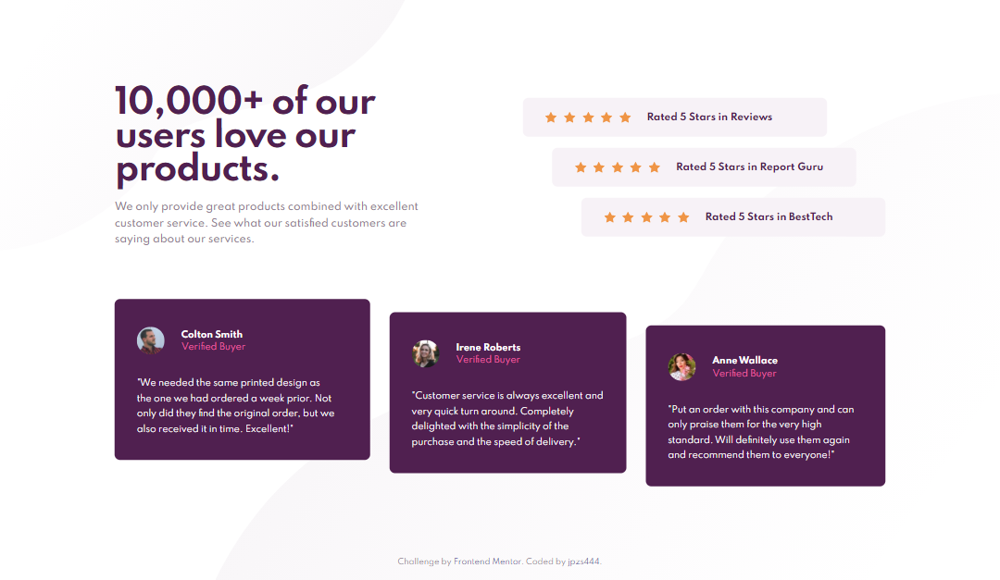

# Frontend Mentor - Social proof section solution

This is a solution to the [Social proof section challenge on Frontend Mentor](https://www.frontendmentor.io/challenges/social-proof-section-6e0qTv_bA). Frontend Mentor challenges help you improve your coding skills by building realistic projects. 

## Table of contents

- [Overview](#overview)
  - [The challenge](#the-challenge)
  - [Screenshot](#screenshot)
  - [Links](#links)
- [My process](#my-process)
  - [Built with](#built-with)
  - [What I learned](#what-i-learned)
- [Author](#author)

## Overview

### The challenge

Users should be able to:

- View the optimal layout for the section depending on their device's screen size

### Screenshot

### Links

- Solution URL: [https://github.com/jpzs444/social-proof-section-2](https://github.com/jpzs444/social-proof-section-2)
- Live Site URL: [https://jpzs444.github.io/social-proof-section-2](https://jpzs444.github.io/social-proof-section-2)

## My process

### Built with

- Semantic HTML5 markup
- CSS custom properties
- Flexbox
- Mobile-first workflow

### What I learned

Using Flexbox properties, especially align-self and justify-self, made the layout easier to copy. 

## Author

- Frontend Mentor - [@jpzs444](https://www.frontendmentor.io/profile/jpzs444)
